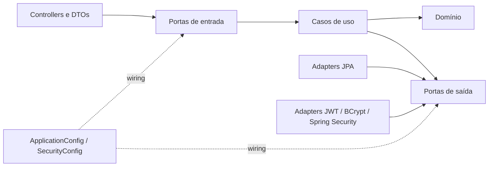
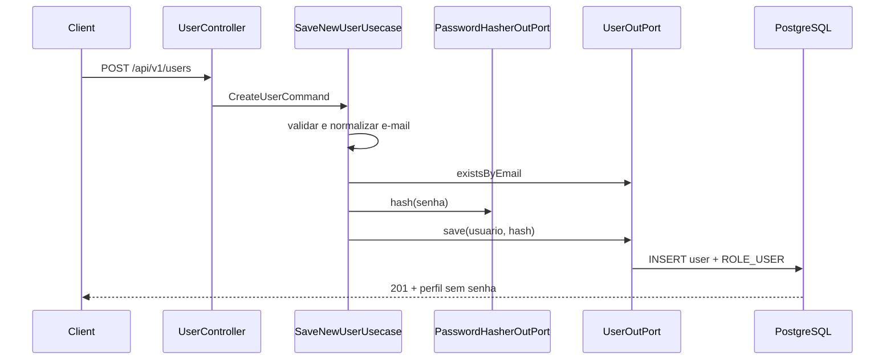
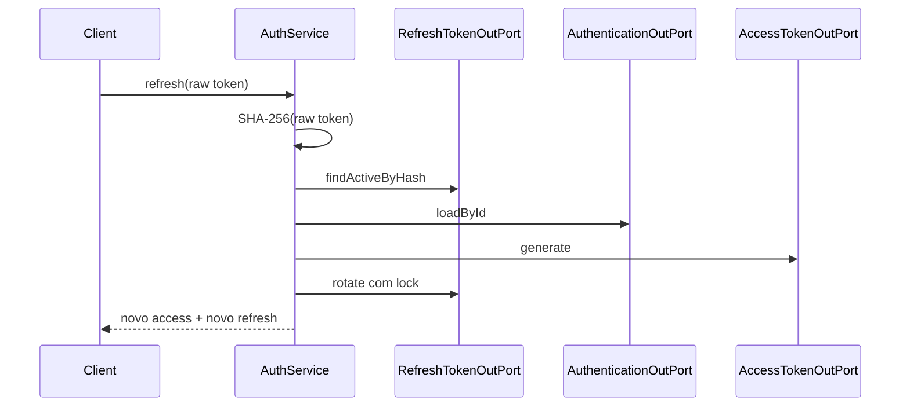

# Arquitetura

## Visão geral

O projeto usa arquitetura hexagonal em um único módulo Maven. O objetivo principal é manter regras de negócio independentes de HTTP, Spring, JPA e provedores de token.

## Responsabilidades

### `application.core`

Contém modelos, comandos, exceções, validações e casos de uso. Não conhece Spring, Jackson, JPA ou classes dos adapters.

### `application.ports.inbound`

Contratos acionados pelos adapters de entrada:

- `AuthInPort`;
- `SaveNewUserInPort`;
- `FindUserByEmailInPort`;
- `FindUserByIdInPort`.

### `application.ports.outbound`

Necessidades externas expressas pelo núcleo:

- persistência de usuários e refresh tokens;
- autenticação de credenciais;
- hash de senha;
- emissão de access token.

### `adapters.inbound`

Controllers REST, validação de payload e conversão entre DTOs e modelos da aplicação.

### `adapters.outbound`

Entidades JPA, repositórios Spring Data e implementações das portas de persistência/segurança.

### `infrastructure`

Composição de beans, filtros HTTP, configuração Spring Security, OpenAPI e tratamento de erros.

## Fluxo de cadastro

## Fluxo de refresh

## Regras automatizadas

`HexagonalArchitectureTest` garante que classes em `application` não dependam de:

- `adapters`;
- `infrastructure`;
- Spring;
- JPA;
- Jackson.

Novas integrações devem começar por uma porta no núcleo e ser implementadas por um adapter externo.

## Convenções

- Injeção por construtor.
- Casos de uso sem anotações de framework.
- Wiring centralizado em classes `@Configuration`.
- Entidades JPA nunca são retornadas pela API.
- DTOs web não atravessam a porta de entrada.
- Horário de autenticação usa `Clock`, permitindo testes determinísticos.
