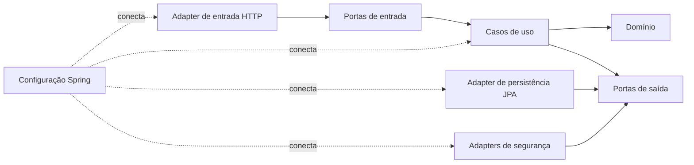
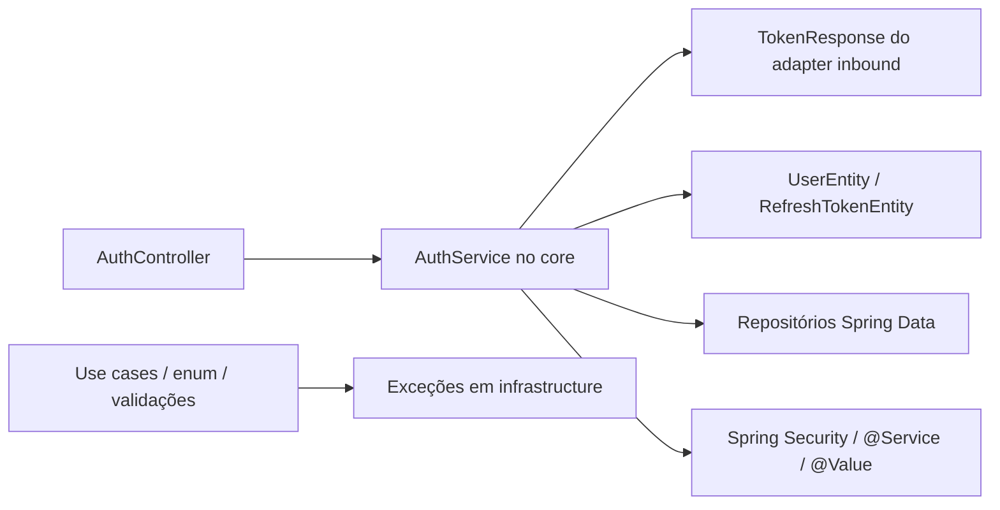

# Avaliação técnica e roadmap do Cointrol

> **Nota de acompanhamento:** este documento registra a linha de base encontrada na auditoria. As correções da fase de estabilização foram implementadas depois da avaliação e estão descritas em [IMPLEMENTACAO_ESTABILIZACAO.md](IMPLEMENTACAO_ESTABILIZACAO.md). Os itens ainda abertos continuam válidos como roadmap.

> **Atualização do MVP financeiro:** contas, categorias, receitas/despesas, extrato, saldos, transferências e resumos foram implementados conforme [IMPLEMENTACAO_MVP_FINANCEIRO.md](IMPLEMENTACAO_MVP_FINANCEIRO.md). As fases de planejamento financeiro e recursos avançados continuam pendentes.

**Data da avaliação:** 16 de agosto de 2026  
**Escopo analisado:** todo o repositório disponível nesta data, incluindo código Java, configuração Spring, persistência, segurança, testes, build e documentação.  
**Estado do código:** há alterações locais de autenticação ainda não commitadas; esta avaliação considera essas alterações como parte do estado atual e não as modifica.

## 1. Resumo executivo

O projeto possui uma boa intenção arquitetural: separa domínio, casos de uso, portas e adaptadores e já tem uma base de autenticação JWT com rotação simples de refresh token. Entretanto, hoje ele deve ser tratado como **protótipo estrutural**, não como uma API financeira pronta para produção.

Os principais motivos são:

- ainda não existe nenhuma feature de controle financeiro; há apenas estruturas parciais de usuário e autenticação;
- a arquitetura é hexagonal nos nomes dos pacotes, mas não na direção real das dependências;
- o cadastro de usuário, quando ativado, persiste a senha sem BCrypt, enquanto o login exige BCrypt;
- o fluxo de usuário está inativo e seus casos de uso/adaptador não estão registrados como beans;
- o DDL gerado contém riscos de incompatibilidade com PostgreSQL e inconsistência de schemas;
- o build compila, mas executa **zero testes**;
- faltam migrações, ambiente local reproduzível, CI, observabilidade e documentação operacional.

### Diagnóstico por área

| Área | Estado | Leitura objetiva |
|---|---|---|
| Compilação | Parcialmente adequada | 42 arquivos Java compilam em Java 21; o Maven alerta para um `scope` inválido do Lombok. |
| Arquitetura hexagonal | Parcial | Há portas e adaptadores, mas o núcleo depende de Spring, DTOs, entidades e repositórios JPA. |
| Funcionalidade | Inicial | Login/refresh/logout estão implementados; cadastro e consulta de usuários não estão expostos; domínio financeiro inexiste. |
| Segurança | Insuficiente para produção | JWT e hash de refresh token são bons começos, mas senha de cadastro, segredo padrão, validação e proteção contra abuso exigem correção. |
| Persistência | Alto risco | Não há migrações; `ddl-auto: update`; UUID com `IDENTITY`; schemas inconsistentes. |
| Testes | Crítico | Existem 2 arquivos de teste, mas nenhum teste ativo. |
| Operação | Inicial | Não há perfis, Docker Compose, health checks, métricas, CI ou guia de execução. |
| Documentação | Crítico | Na abertura da avaliação, o `README.md` continha somente o nome do projeto; agora ele também aponta para este relatório. |

**Conclusão:** antes de criar transações, contas e dashboards, recomenda-se uma fase curta de estabilização. O objetivo é obter um primeiro corte vertical confiável: cadastrar usuário, autenticar, persistir em PostgreSQL por migração e validar tudo em CI.

## 2. O que foi validado

### 2.1 Verificações executadas

| Verificação | Resultado | Observação |
|---|---|---|
| Inventário do repositório | Concluído | 42 arquivos Java de produção e 2 arquivos Java de teste. |
| `mvnw test` | **Build success** | Compilação concluída, porém nenhum teste foi descoberto/executado. |
| Montagem do contexto Spring web | Concluída com configuração diagnóstica | A aplicação iniciou com `ddl-auto=none` e conexão indisponível; isso valida o grafo principal de beans, não o funcionamento do banco. |
| Geração de DDL Hibernate | Concluída | Revelou UUID `IDENTITY` e tabela de junção fora do schema das tabelas relacionadas. |
| `mvnw dependency:analyze` | Concluído com alertas | O resultado tem falsos positivos comuns para starters, mas reforça a necessidade de limpar dependências diretas redundantes. |
| Inspeção estática de dependências entre camadas | Concluída | Foram encontradas dependências do núcleo para adapters, infrastructure e Spring. |
| Teste integrado com PostgreSQL real | **Não executado** | O repositório não fornece banco local, migrations, credenciais de teste ou Testcontainers. |
| Análise dinâmica de vulnerabilidades | **Não executada** | Não há scanner configurado no build/CI. Deve entrar na fase de fundação. |

### 2.2 Resultado do build

O comando de teste concluiu com sucesso, mas esse sucesso representa somente compilação. Não há métodos anotados com `@Test`; `StartupTests` está inteiramente comentado e `UserMocks` está vazio.

Também foi emitido o alerta:

```text
'dependencies.dependency.scope' for org.projectlombok:lombok:jar ... is 'annotationProcessor'
```

Portanto, o build verde atual não é uma evidência de comportamento correto.

## 3. Avaliação da arquitetura hexagonal

### 3.1 Regra esperada

Em uma arquitetura hexagonal, as dependências apontam para dentro:



O domínio e os casos de uso não deveriam conhecer HTTP, Spring Security, JPA, DTOs web ou classes de infraestrutura.

### 3.2 Dependências atuais que quebram essa regra



Achados principais:

- `AuthService` está em `application.core`, mas importa DTO de resposta, entidades JPA, repositórios Spring Data, `AuthenticationManager`, anotações Spring e transação Jakarta;
- `JwtService` está no núcleo, mas depende de `UserEntity`, `GrantedAuthority`, `@Value` e `@Service`;
- `Gender`, `UserValidationUtil` e `SaveNewUserUsecase` dependem de exceções colocadas em `infrastructure`, invertendo a direção esperada;
- `AuthController` depende da implementação concreta `AuthService`, não de uma porta de entrada;
- `AuthInPort` existe, retorna `String`, não cobre refresh/logout e não é implementada por `AuthService`;
- `UserAdapters` implementa a porta de saída, mas não é bean e também não há uma configuração que o registre;
- os três casos de uso de usuário não são beans nem são expostos por uma configuração;
- o `UserController` está todo comentado e referencia tipos antigos/inexistentes.

### 3.3 Estrutura recomendada

Uma reorganização segura pode ser incremental, sem precisar transformar o projeto em múltiplos módulos Maven de imediato:

```text
com.fcproject
├── domain
│   ├── model
│   ├── service
│   └── exception
├── application
│   ├── port
│   │   ├── in
│   │   └── out
│   └── usecase
├── adapter
│   ├── in
│   │   └── web
│   └── out
│       ├── persistence
│       └── security
└── infrastructure
    └── config
```

Regras a automatizar com ArchUnit:

1. `domain` só depende de Java e do próprio domínio.
2. `application` depende apenas de `domain` e das portas.
3. adapters podem depender do núcleo; o núcleo não pode depender de adapters.
4. Spring/JPA/Jackson ficam fora de `domain` e, preferencialmente, fora dos casos de uso.
5. controllers dependem de portas de entrada, não de implementações.

### 3.4 Desenho sugerido para autenticação

O caso de uso de login pode depender das seguintes abstrações:

- `LoadUserCredentialsPort`;
- `PasswordHasherPort` com `matches` e `hash`;
- `AccessTokenPort`;
- `RefreshTokenRepositoryPort`;
- `SecureTokenGeneratorPort`;
- `Clock` ou uma porta de tempo para testes determinísticos.

O caso de uso retorna um modelo de aplicação, por exemplo `IssuedTokens`, e o controller o converte para `TokenResponse`. Spring Security, JWT Auth0, BCrypt e JPA ficam nos adapters.

## 4. Achados técnicos priorizados

### 4.1 P0 — bloquear release e novas features dependentes

| ID | Achado | Evidência | Impacto | Correção recomendada |
|---|---|---|---|---|
| P0-01 | Senha de cadastro não é codificada | `SaveNewUserUsecase` envia o domínio ao adapter; `UserMapper` copia a senha diretamente para `password_hash`; o login usa `BCryptPasswordEncoder`. | Senha pode ficar em texto puro e o login do usuário criado tende a falhar. | Criar `PasswordHasherPort`, aplicar BCrypt antes de persistir e testar que o hash não contém a senha original. Nunca transportar o hash em respostas. |
| P0-02 | Persistência sem migrations e com DDL arriscado | `ddl-auto: update`; não existe `db/migration`; DDL gerado contém `id uuid generated by default as identity`. | Banco não reproduzível e provável falha de criação/alteração no PostgreSQL. | Adotar Flyway, definir UUID com estratégia adequada, criar schema explicitamente e usar `ddl-auto: validate` fora de testes. |
| P0-03 | Schemas inconsistentes | `users`, `roles` e `refresh_tokens` usam schema `acess`; `user_roles` foi gerada sem schema. | FKs podem cruzar schemas acidentalmente ou falhar por `search_path`. | Confirmar se o nome desejado é `access`; colocar todas as tabelas relacionadas no mesmo schema e versionar isso na migration. |
| P0-04 | Nenhum teste ativo | Zero ocorrências ativas de `@Test`. | Regressões de segurança, saldo e persistência passam com build verde. | Criar testes unitários dos casos de uso, testes web, JPA com PostgreSQL/Testcontainers e testes de arquitetura. |
| P0-05 | Segredo JWT possui fallback conhecido | `application.yml` aceita um segredo padrão legível. | Um deploy mal configurado emitiria tokens falsificáveis. | Remover fallback em produção, validar tamanho/entropia no startup e separar perfil `local`. |
| P0-06 | Fluxo de usuário não está operacional | Controller comentado; adapter e casos de uso sem beans. | Não há caminho suportado para cadastrar ou consultar usuários; login depende de dados externos previamente inseridos. | Implementar um corte vertical de registro/perfil via portas, configurar beans e documentar contrato. |

### 4.2 P1 — concluir antes do MVP público

| ID | Achado | Impacto | Ação |
|---|---|---|---|
| P1-01 | Normalização do e-mail ocorre depois da busca de duplicidade | Variações de caixa/espaços podem virar conflito no banco e resposta 500. | Normalizar antes de validar/buscar; manter índice único sobre valor normalizado e traduzir `DataIntegrityViolationException` para 409. |
| P1-02 | DTOs de autenticação não usam Bean Validation e controllers não usam `@Valid` | Nulos e vazios chegam ao Spring Security/repositório e podem gerar 500 ou respostas inconsistentes. | Usar records/DTOs com `@NotBlank`, `@Email`, limites de tamanho e `@Valid`. |
| P1-03 | `TokenResponse` pode expor `accessToken` e `acessToken` | Contrato ambíguo e difícil de evoluir. | Publicar apenas `accessToken`; se compatibilidade for necessária, aceitar alias somente na desserialização e definir prazo de remoção. |
| P1-04 | Handler global tem parâmetros `HttpStatus` não suportados como argumento de handler | O tratamento de conflito/not-found pode falhar quando acionado. | Remover esses parâmetros, usar `ProblemDetail` e adicionar testes de contrato para cada exceção. |
| P1-05 | `DataNotFound` retorna 204 | `204 No Content` significa sucesso sem corpo, não recurso ausente. | Usar 404 para recurso inexistente e reservar 204 para delete/update bem-sucedido sem corpo. |
| P1-06 | Filtro JWT engole qualquer `RuntimeException` | Token inválido perde diagnóstico; endpoint protegido tende a responder 403 em vez de 401. | Tratar exceções JWT específicas, configurar `AuthenticationEntryPoint` e padronizar 401/403. |
| P1-07 | Refresh token não tem família/replay detection nem limpeza | Reutilização de token revogado não invalida a sessão; tabela cresce continuamente. | Modelar sessão/família, detectar reuse, revogar família, limitar sessões e limpar expirados. |
| P1-08 | Flags de conta tratam `null` como `true` | Registros antigos/incompletos podem ganhar acesso por padrão. | Tornar colunas `NOT NULL` com defaults explícitos e tratar `null` como estado inválido ou bloqueado. |
| P1-09 | Mapeamento JPA tem tipos e nomes frágeis | `bit(1)` para boolean, `update_at`, datas de auditoria como `LocalDate` e `@Data` em entidade. | Usar boolean nativo, `created_at/updated_at` como `Instant`, callbacks/auditing, `@Version` e métodos explícitos. |
| P1-10 | `UserInfoResponse.id` é `long`, enquanto a entidade usa `UUID` | Mapeamento/serialização incorretos ao reativar o endpoint. | Padronizar IDs como UUID de ponta a ponta. |
| P1-11 | `UserDomain` possui `setBirthDay`, não `setDateOfBirth` | Mappers por convenção podem ignorar o campo. | Padronizar o nome ou tornar o domínio imutável, criado por construtor/factory. |
| P1-12 | `@ManyToMany` e entidades com igualdade ampla | Lazy loading inesperado, custo alto e possíveis ciclos; o modelo de autorização fica difícil de auditar. | Preferir entidade de associação `UserRole` ou, no mínimo, igualdade apenas por identidade estável e `toString` sem segredos/relacionamentos. |
| P1-13 | OpenAPI fica público em qualquer ambiente | Amplia superfície de enumeração em produção. | Restringir por perfil ou autenticação; documentar esquema Bearer. |
| P1-14 | Ausência de CORS e política de origem | Integração web será improvisada ou permissiva demais. | Definir allowlist por ambiente, métodos/headers necessários e testes. |

### 4.3 P2 — qualidade, manutenção e operação

- Corrigir o `scope` do Lombok para `provided` e configurar `annotationProcessorPaths` no compiler plugin, ou remover Lombok gradualmente.
- Remover dependências diretas redundantes (`mockito-core`, `jakarta.persistence-api`) quando confirmado pelo build.
- Avaliar a remoção de Dozer; para poucos modelos, mappers explícitos ou MapStruct deixam contratos mais previsíveis.
- Remover código morto: `UserController` comentado, `FileStorageException` sem uso, mocks vazios e utilitários não usados.
- Renomear `GlobalHanlder` para `GlobalHandler`, `Usecase` para `UseCase` e `userPorts` para pacote minúsculo (`user`).
- Desabilitar explicitamente `spring.jpa.open-in-view`.
- Remover o dialect explícito, já que o Hibernate o detecta pelo driver/banco.
- Criar perfis `local`, `test` e `prod` com diferenças intencionais.
- Adicionar logs estruturados, correlation ID, métricas e health/readiness checks.
- Configurar Checkstyle ou Spotless, JaCoCo, ArchUnit e análise de vulnerabilidades/SBOM no CI.
- Versionar um `.env.example` sem segredos e um Docker Compose para PostgreSQL local.
- Completar o `README.md` com setup, decisões arquiteturais, comandos e exemplos da API.

## 5. Decisões de domínio antes das features financeiras

Estas decisões evitam retrabalho e erros de saldo:

1. **Dinheiro:** usar `BigDecimal` com escala e arredondamento explícitos; nunca `double`/`float`.
2. **Moeda:** definir se uma conta tem uma única moeda; armazenar código ISO 4217. Não somar moedas diferentes sem taxa/cotação registrada.
3. **Datas:** diferenciar data efetiva da transação, data de competência e instante de criação; definir timezone da aplicação.
4. **Transferências:** modelar como uma operação que gera duas movimentações vinculadas e atômicas, nunca como despesa solta.
5. **Saldo:** decidir entre cálculo por razão de lançamentos ou saldo materializado. Para o MVP, razão + consultas agregadas costuma ser mais segura.
6. **Status:** prever transação `PENDING`, `CLEARED` e `CANCELED`; cancelamento não deve apagar histórico financeiro.
7. **Idempotência:** POSTs financeiros devem aceitar chave de idempotência para evitar duplicidade por retry.
8. **Concorrência:** usar transações de banco e `@Version` onde houver agregados mutáveis.
9. **Propriedade:** toda consulta financeira deve ser limitada ao `userId`/tenant autenticado; não aceitar proprietário vindo livremente do payload.
10. **Auditoria:** registrar quem criou/alterou, quando e qual operação originou o lançamento.
11. **Exclusão:** preferir arquivamento/soft delete para contas e categorias já usadas; lançamentos devem preservar trilha histórica.
12. **Privacidade:** minimizar PII, definir retenção, exportação e exclusão de conta desde o início.

## 6. Roadmap de melhorias da base

### Fase 0 — estabilização (primeiro objetivo)

**Saída esperada:** registro + login + refresh + logout funcionando em PostgreSQL local e CI, com arquitetura e testes mínimos.

| Ordem | Entrega | Critérios de aceite |
|---:|---|---|
| 1 | Corrigir build e ambiente | `mvnw verify` sem warning estrutural; Java 21 documentado; `.env.example`; Docker Compose do PostgreSQL. |
| 2 | Introduzir Flyway | Migration cria schema/tabelas/índices/FKs; `ddl-auto=validate`; banco sobe do zero de forma determinística. |
| 3 | Corrigir modelo de usuário | UUID consistente; senha BCrypt; campos obrigatórios; timestamps; flags `NOT NULL`; e-mail normalizado e único. |
| 4 | Restaurar corte vertical de cadastro | `POST /api/v1/users` via porta de entrada; 201; conflitos 409; sem expor senha/hash. |
| 5 | Desacoplar autenticação | Controller chama porta; caso de uso não importa Spring/JPA/DTO; tokens e hashing por portas de saída. |
| 6 | Padronizar erros | `ProblemDetail`, códigos estáveis, 400/401/403/404/409 corretos e sem detalhes internos. |
| 7 | Criar suíte essencial | Unitários, `@WebMvcTest`, `@DataJpaTest`/Testcontainers, fluxo auth integrado e ArchUnit. |
| 8 | Configurar CI | Compile, testes, cobertura, formatação, análise arquitetural, dependency scan e artefato/SBOM. |

### Fase 1 — núcleo do MVP financeiro

#### 1. Contas financeiras

- Criar conta (corrente, poupança, dinheiro, investimento inicial simplificado).
- Listar, editar nome e arquivar.
- Definir moeda e saldo inicial por lançamento, sem campo de saldo editável arbitrariamente.
- Garantir isolamento por usuário.

**Aceite:** usuário A nunca acessa conta de B; conta arquivada preserva histórico; saldo inicial aparece na razão.

#### 2. Categorias

- Categorias de receita e despesa.
- Categorias padrão e personalizadas por usuário.
- Arquivamento sem quebrar transações antigas.

**Aceite:** não é possível usar categoria de receita em despesa sem regra explícita; nomes duplicados seguem política definida.

#### 3. Transações

- Receita, despesa e transferência.
- CRUD com paginação e filtros por período, conta, categoria e status.
- Valor monetário, descrição, data efetiva, observação e idempotency key.
- Transferência atômica com duas pernas vinculadas.

**Aceite:** nenhuma operação parcial; retries não duplicam; valores inválidos e acesso cruzado são rejeitados.

#### 4. Visão geral

- Saldo por conta e consolidado por moeda.
- Receitas, despesas e resultado do período.
- Gastos por categoria.
- Série temporal mensal.

**Aceite:** totais reconciliam com a lista de transações e filtros usam a mesma regra de período/status.

### Fase 2 — planejamento financeiro

1. **Orçamentos mensais:** limite por categoria, realizado, restante e percentual.
2. **Recorrências:** regras de repetição com geração idempotente e possibilidade de pausar.
3. **Parcelamentos:** grupo de parcelas, número atual/total e edição futura controlada.
4. **Metas:** valor-alvo, prazo, contribuições e progresso.
5. **Alertas:** orçamento perto do limite, conta negativa e recorrência próxima.

### Fase 3 — recursos avançados

1. Cartões de crédito, ciclos e faturas.
2. Importação CSV/OFX com prévia, deduplicação e conciliação.
3. Exportação CSV/PDF e relatórios comparativos.
4. Regras automáticas de categorização.
5. Compartilhamento familiar/organizações, somente após modelar tenant e permissões.
6. Integração bancária, somente com avaliação regulatória, consentimento, criptografia e gestão de segredos.

## 7. Backlog técnico sugerido

| ID | Prioridade | Item | Dependência | Tamanho relativo |
|---|---|---|---|---|
| TECH-001 | P0 | Corrigir Lombok e limpar o `pom.xml` | — | P |
| TECH-002 | P0 | Docker Compose + `.env.example` + perfil local | — | M |
| TECH-003 | P0 | Flyway inicial e correção dos schemas/UUID | TECH-002 | M |
| TECH-004 | P0 | Porta de hash + cadastro BCrypt | TECH-003 | M |
| TECH-005 | P0 | Reativar cadastro via controller/porta | TECH-004 | M |
| TECH-006 | P0 | Testcontainers PostgreSQL e fluxo de autenticação | TECH-003, TECH-005 | G |
| TECH-007 | P1 | Refatorar auth para portas hexagonais | TECH-006 | G |
| TECH-008 | P1 | Padronizar erros com `ProblemDetail` | TECH-005 | M |
| TECH-009 | P1 | Validação de DTOs e limites de entrada | TECH-008 | P |
| TECH-010 | P1 | Refresh token family/replay/cleanup | TECH-007 | G |
| TECH-011 | P1 | ArchUnit com regras de camadas | TECH-007 | M |
| TECH-012 | P1 | CI, JaCoCo, formatter e scanner | TECH-006 | M |
| TECH-013 | P1 | Actuator, métricas, logs e correlation ID | TECH-012 | M |
| TECH-014 | P2 | Remover Dozer/código morto e normalizar nomes | TECH-011 | M |

Legenda: P = pequeno, M = médio, G = grande. O tamanho é relativo e deve ser refinado após os contratos do domínio.

## 8. Estratégia de testes

### 8.1 Testes unitários

Casos mínimos:

- validação e normalização de e-mail;
- política e hash de senha;
- usuário duplicado e corrida de unicidade traduzida para 409;
- emissão, expiração, rotação, revogação e reuse de refresh token;
- criação/edição/cancelamento de transação;
- transferência atômica;
- cálculo de saldo, resumo e orçamento;
- autorização por proprietário/tenant.

Os casos de uso devem ser testados sem Spring e sem banco.

### 8.2 Testes de adapters

- `@WebMvcTest`: contrato JSON, validação, status, autenticação e erros.
- Testes de serialização: garantir nomes únicos como `accessToken`.
- `@DataJpaTest` com PostgreSQL/Testcontainers: queries, constraints, UUID, schemas e concorrência.
- Testes JWT: issuer, audience, expiração, assinatura inválida e conta desabilitada.

### 8.3 Testes integrados

- PostgreSQL real via Testcontainers e migrations Flyway.
- Fluxo `register → login → endpoint protegido → refresh → logout`.
- Fluxo `conta → transações → transferência → dashboard`.
- Requisições repetidas com a mesma idempotency key.

### 8.4 Metas de qualidade

- 100% das regras financeiras críticas cobertas por testes de comportamento.
- Cobertura de branch alta nos casos de uso; usar cobertura como alerta, não como única meta.
- Toda correção de bug inclui teste de regressão.
- Nenhuma regra do domínio depende de Spring em testes unitários.
- CI deve falhar se nenhum teste for executado.

## 9. Contratos e padrões da API

- Prefixar recursos com `/api/v1`.
- Usar substantivos: `/accounts`, `/categories`, `/transactions`, `/budgets`.
- Retornar 201 com `Location` na criação; 204 em exclusão/arquivamento sem corpo.
- Padronizar erros com `application/problem+json` e campos `type`, `title`, `status`, `detail`, `instance`, `code` e erros de campo.
- Paginar listas e impor limite máximo de página.
- Usar ordenação explícita e estável.
- Documentar autenticação Bearer e exemplos no OpenAPI.
- Definir política de compatibilidade antes de publicar clientes.
- Não retornar entidade JPA diretamente.

## 10. Segurança e privacidade

Checklist mínimo antes de exposição pública:

- segredo JWT obrigatório por ambiente e fora do repositório;
- rotação planejada de chaves/segredos e identificação de chave se necessário;
- rate limit para login, refresh, recuperação e endpoints de escrita;
- mensagens de login que não revelem se o e-mail existe;
- política de senha e possibilidade futura de recuperação/verificação de e-mail;
- revogação de sessões, logout por sessão e logout global;
- CORS por allowlist;
- Swagger restrito em produção;
- limites de tamanho de request e strings;
- logs sem senha, token, hash ou dados financeiros sensíveis;
- auditoria de ações relevantes;
- dependency scanning, secret scanning e SBOM no CI;
- TLS obrigatório no ambiente publicado;
- política de retenção, exportação e exclusão de dados compatível com LGPD.

## 11. Operação e documentação

O `README.md` deve passar a responder:

1. O que é o produto e qual estágio atual.
2. Pré-requisitos: Java 21, Docker e variáveis.
3. Como subir PostgreSQL e a aplicação.
4. Como rodar `test`, `verify`, formatter e migrations.
5. Onde acessar OpenAPI/Swagger local.
6. Visão da arquitetura e regras de dependência.
7. Convenções de commit/branch e Definition of Done.
8. Troubleshooting comum, inclusive `JAVA_HOME`.

Também são recomendados:

- ADRs para dinheiro/moeda, transferências, autenticação e multi-tenancy;
- changelog ou release notes;
- coleção de requests ou exemplos `curl` sem segredos;
- runbook de migration/rollback, backup e incidentes.

## 12. Definition of Done

Uma feature só deve ser considerada pronta quando:

- regra e critérios de aceite estão claros;
- respeita as regras hexagonais automatizadas;
- possui validação e autorização por proprietário;
- possui testes unitários e integrados proporcionais ao risco;
- migrations são versionadas e testadas do zero;
- contrato OpenAPI e exemplos foram atualizados;
- erros e logs não expõem dados sensíveis;
- métricas/logs permitem diagnosticar falhas;
- CI está verde e executou testes de fato;
- documentação operacional foi atualizada.

## 13. Próxima entrega recomendada

O próximo marco não deve ser “dashboard”. Deve ser:

> **Um usuário consegue subir o ambiente do zero, cadastrar-se com senha protegida, autenticar, renovar/revogar a sessão e acessar um endpoint protegido; tudo é criado por migrations e validado automaticamente em PostgreSQL no CI.**

Depois desse marco, a primeira feature financeira deve ser o corte vertical **conta + lançamento + saldo**, já com isolamento por usuário e testes de integração. Essa sequência reduz muito o risco de retrabalho nas features seguintes.
