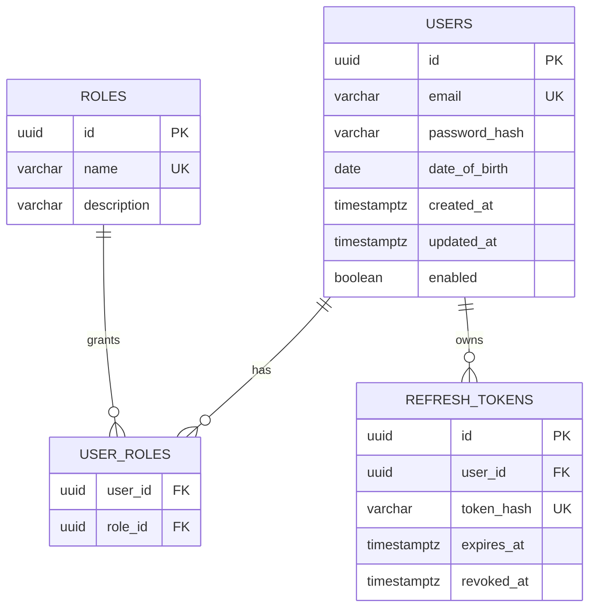

# Banco de dados e migrations

## Tecnologia e propriedade do schema

O banco suportado é PostgreSQL. O Flyway é responsável pela estrutura; o Hibernate apenas valida o resultado com `ddl-auto: validate`.

O schema da aplicação é `access`. O nome anterior `acess` foi corrigido.

## Scripts versionados

| Versão | Arquivo | Função |
|---|---|---|
| V1 | `src/main/resources/db/migration/V1__create_access_schema.sql` | Cria schema, usuários, papéis, associação e refresh tokens. |
| V2 | `src/main/resources/db/migration/V2__seed_default_roles.sql` | Insere `ROLE_USER` e `ROLE_ADMIN`. |
| V3 | `src/main/resources/db/migration/V3__create_access_indexes.sql` | Cria índices de consulta/limpeza de refresh tokens. |

O Flyway mantém `access.flyway_schema_history` e aplica cada versão uma única vez.

## Modelo atual



## Subir o PostgreSQL local

```powershell
docker compose up -d postgres
docker compose ps
```

O volume `cointrol-postgres-data` preserva dados entre reinicializações.

Depois, iniciar a aplicação:

```powershell
$env:SPRING_PROFILES_ACTIVE='local'
.\mvnw.cmd spring-boot:run
```

As migrations são aplicadas automaticamente antes da criação do `EntityManagerFactory`.

## Variáveis

| Variável | Descrição |
|---|---|
| `PG_DB_URL` | URL JDBC completa. |
| `PG_DB_USERNAME` | Usuário PostgreSQL. |
| `PG_DB_PASSWORD` | Senha PostgreSQL. |
| `POSTGRES_DB` | Banco criado pelo container. |
| `POSTGRES_USER` | Usuário criado pelo container. |
| `POSTGRES_PASSWORD` | Senha usada pelo container. |

Os valores locais estão em `application-local.yml` e `.env.example`; não devem ser reutilizados em produção.

## Banco preexistente no schema `acess`

As migrations atuais assumem um banco novo. Se já houver dados reais no schema antigo `acess`, **não renomeie nem apague tabelas manualmente**.

Procedimento recomendado:

1. Fazer backup verificado.
2. Inventariar tabelas, colunas, constraints e volume de dados.
3. Criar uma migration específica de transição para `access`.
4. Converter `password` somente se já contiver BCrypt; senha em texto puro exige reset seguro, não migração direta.
5. Validar contagens e FKs em ambiente de cópia.
6. Planejar rollback antes da aplicação em produção.

Essa migration não foi automatizada porque o repositório não informa se existe banco com dados nem qual é seu conteúdo.

## Política para novas migrations

- Nunca editar uma migration já aplicada em ambiente compartilhado.
- Criar sempre a próxima versão `Vn__descricao.sql`.
- Toda migration deve funcionar a partir de um banco vazio no teste Testcontainers.
- Alterações destrutivas exigem estratégia em duas etapas e backup.
- Índices grandes devem considerar criação concorrente e janela operacional.
- Dados de referência devem usar IDs estáveis e operações idempotentes quando apropriado.

## Teste automatizado

`DatabaseMigrationTest` cria um PostgreSQL 17 vazio, aplica todas as migrations e valida tabelas e papéis.

```powershell
docker info
.\mvnw.cmd test
```

Sem Docker ativo, somente esse teste é ignorado; no CI ele deve ser executado.
