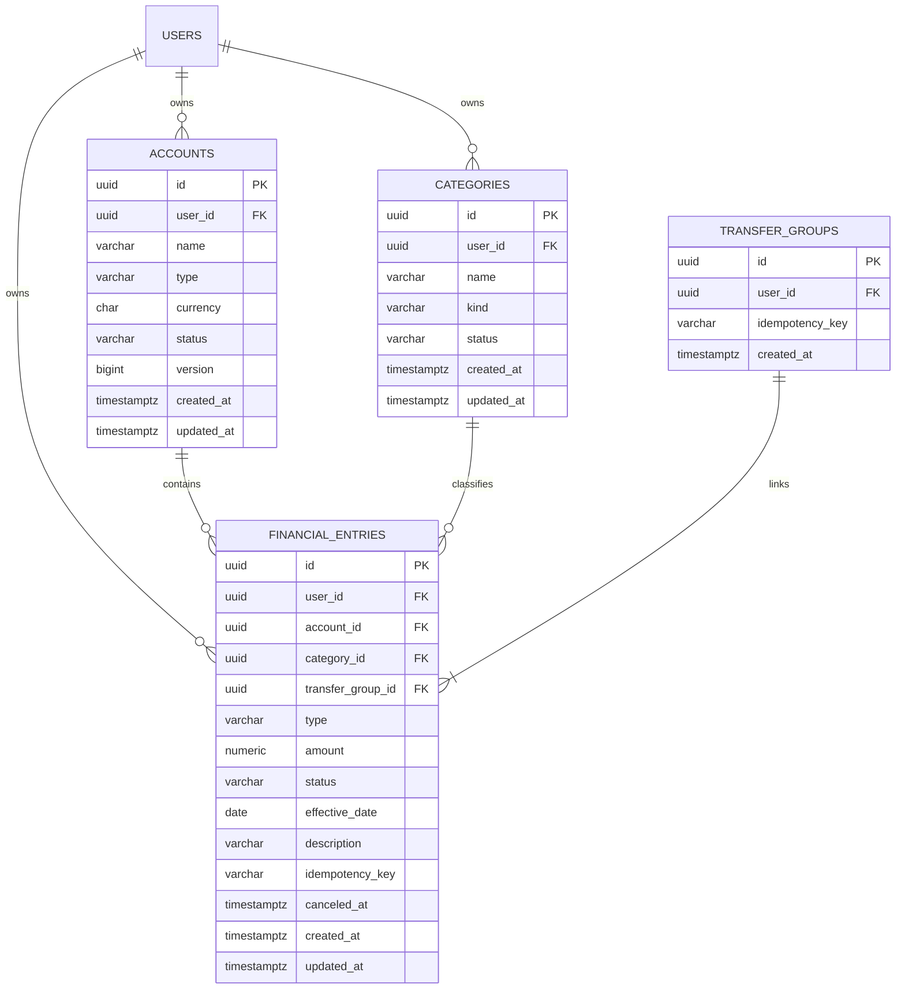
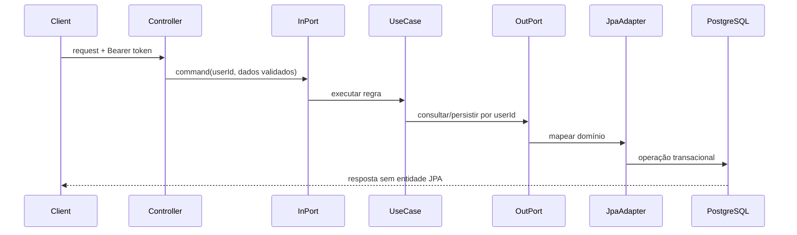

# Guia de implementação das features financeiras

> **Status:** as entregas FIN-001 a FIN-007 deste guia foram implementadas no primeiro MVP. Consulte [IMPLEMENTACAO_MVP_FINANCEIRO.md](IMPLEMENTACAO_MVP_FINANCEIRO.md) para o resultado, as validações e os limites atuais.

## 1. Objetivo

Este documento orienta a construção incremental do núcleo financeiro do Cointrol. Ele transforma o roadmap em entregas verticais, mantendo a arquitetura hexagonal, a segurança por proprietário, a rastreabilidade financeira e a evolução versionada do banco.

O primeiro marco funcional deve permitir que um usuário autenticado:

1. crie uma conta;
2. registre receitas e despesas;
3. consulte o extrato;
4. veja o saldo calculado;
5. transfira valores entre suas contas sem persistência parcial.

Dashboard, orçamento, recorrência, cartão e importação ficam fora desse primeiro marco.

## 2. Pré-requisitos

Antes de iniciar uma feature financeira:

- executar `docker compose up -d postgres`;
- executar `.\mvnw.cmd verify` com Docker ativo;
- confirmar que o teste Testcontainers não foi ignorado;
- validar o fluxo `cadastro -> login -> perfil -> refresh -> logout`;
- manter o schema de identidade `access` sob responsabilidade do Flyway;
- não editar migrations que já tenham sido aplicadas.

## 3. Decisões obrigatórias de domínio

Estas regras são a linha de base do MVP. Qualquer mudança deve ser registrada em um ADR dentro de `docs/adr`.

### 3.1 Dinheiro

- Usar `BigDecimal` em Java e `NUMERIC(19,4)` no PostgreSQL.
- Nunca usar `double` ou `float` para valores monetários.
- Valores informados devem ser maiores que zero.
- O sentido financeiro é determinado pelo tipo do lançamento, não pelo sinal recebido na API.
- Arredondamento deve ser explícito e compatível com a moeda da conta.

### 3.2 Moeda

- Cada conta possui uma única moeda em código ISO 4217, como `BRL` ou `USD`.
- Um lançamento herda a moeda da conta; o cliente não escolhe outra moeda no payload.
- Saldos de moedas diferentes nunca são somados.
- Conversão cambial não faz parte do MVP.

### 3.3 Saldo

- O saldo é calculado a partir dos lançamentos confirmados.
- Não deve existir endpoint para alterar o saldo diretamente.
- Um saldo inicial é registrado como lançamento `OPENING_BALANCE`.
- Lançamentos `PENDING` não compõem o saldo disponível.
- Lançamentos cancelados permanecem no histórico, mas não compõem o saldo.

### 3.4 Datas

- `effectiveDate`: data financeira escolhida pelo usuário, representada por `LocalDate`.
- `createdAt` e `updatedAt`: instantes técnicos em UTC, representados por `Instant`.
- A API deve documentar que datas sem horário seguem o calendário do usuário, não o timezone do servidor.

### 3.5 Propriedade e autorização

- O `userId` sempre vem da identidade autenticada.
- Nenhum endpoint financeiro aceita `userId` no payload.
- Toda leitura e escrita no banco deve filtrar pelo proprietário.
- Um recurso de outro usuário deve responder `404`, evitando confirmar sua existência.
- IDs públicos são UUIDs.

### 3.6 Exclusão e auditoria

- Contas e categorias usadas devem ser arquivadas, não removidas.
- Lançamentos financeiros não devem ser apagados fisicamente.
- Correções acontecem por edição controlada ou cancelamento auditável.
- Toda entidade mutável deve possuir `created_at`, `updated_at` e controle otimista com `@Version` quando aplicável.

### 3.7 Idempotência

- Criação de lançamento e transferência aceita o header `Idempotency-Key`.
- A chave é única por usuário e operação.
- Repetir a mesma chave e o mesmo payload retorna o resultado original.
- Repetir a chave com payload diferente retorna `409 Conflict`.

## 4. Modelo inicial



Enums iniciais:

| Conceito | Valores iniciais |
|---|---|
| Tipo de conta | `CHECKING`, `SAVINGS`, `CASH`, `INVESTMENT` |
| Estado da conta | `ACTIVE`, `ARCHIVED` |
| Tipo de categoria | `INCOME`, `EXPENSE` |
| Estado da categoria | `ACTIVE`, `ARCHIVED` |
| Tipo de lançamento | `INCOME`, `EXPENSE`, `OPENING_BALANCE`, `TRANSFER_IN`, `TRANSFER_OUT` |
| Estado do lançamento | `PENDING`, `CLEARED`, `CANCELED` |

Os valores dos enums persistidos são contratos. Renomeá-los exige migration e estratégia de compatibilidade.

## 5. Padrão arquitetural para cada feature

Cada feature deve atravessar as camadas sem levar dependências externas para o núcleo:

```text
application/core/domain/finance/       modelos e regras
application/core/commands/finance/     comandos imutáveis
application/core/usecases/finance/     implementação dos casos de uso
application/ports/inbound/finance/     operações oferecidas pela aplicação
application/ports/outbound/finance/    necessidades de persistência/tempo
adapters/inbound/controllers/          endpoints REST
adapters/inbound/dto/finance/          requests e responses
adapters/outbound/entities/finance/    entidades JPA
adapters/outbound/persistence/finance/ Spring Data repositories
adapters/outbound/                      implementação das portas
infrastructure/config/                 composição dos beans
```

Regras:

- controllers dependem de portas de entrada;
- casos de uso dependem somente do domínio e de portas;
- comandos não usam anotações Jackson, Spring ou JPA;
- entidades JPA não atravessam portas;
- DTOs não entram no núcleo;
- conversões entre domínio e persistência ficam no adapter;
- o usuário autenticado é convertido em UUID antes de chamar o caso de uso;
- novos pacotes devem ser incluídos nas regras do `HexagonalArchitectureTest`.

Fluxo de referência:



## 6. Sequência de implementação

### Etapa 0 — decisões e fundação

Entregas:

- criar ADRs para dinheiro/moeda, saldo, transferências e idempotência;
- criar o schema `finance` em uma nova migration;
- definir um componente de obtenção do usuário atual reutilizável pelos controllers;
- padronizar paginação, ordenação e erros de regra financeira;
- decidir o limite máximo de página, inicialmente recomendado em 100 itens.

Migration sugerida:

```text
V4__create_finance_schema.sql
```

Critérios de aceite:

- migration funciona em banco vazio;
- Hibernate inicia com `ddl-auto=validate`;
- teste ArchUnit continua verde;
- nenhum código do núcleo importa Spring ou JPA.

### Etapa 1 — contas financeiras

Casos de uso:

- `CreateAccount`;
- `ListAccounts`;
- `GetAccount`;
- `UpdateAccount`;
- `ArchiveAccount`.

Contrato recomendado:

| Método | Endpoint | Resultado |
|---|---|---|
| `POST` | `/api/v1/accounts` | Cria conta e retorna `201` com `Location`. |
| `GET` | `/api/v1/accounts` | Lista contas do usuário, com filtro por status. |
| `GET` | `/api/v1/accounts/{id}` | Retorna uma conta do usuário. |
| `PATCH` | `/api/v1/accounts/{id}` | Altera nome e propriedades permitidas. |
| `DELETE` | `/api/v1/accounts/{id}` | Arquiva e retorna `204`. |

Payload mínimo de criação:

```json
{
  "name": "Conta principal",
  "type": "CHECKING",
  "currency": "BRL"
}
```

Regras:

- nome obrigatório, normalizado e limitado a 100 caracteres;
- moeda não pode mudar depois do primeiro lançamento;
- conta arquivada não recebe novos lançamentos;
- consulta sempre combina `id` e `userId`;
- a resposta pode apresentar saldo zero até a etapa de lançamentos.

Migration sugerida:

```text
V5__create_accounts.sql
```

Testes mínimos:

- criação válida e campos inválidos;
- nomes duplicados conforme política definida;
- isolamento entre usuários;
- arquivamento idempotente;
- conta de outro usuário retorna 404;
- constraints e índices no PostgreSQL.

### Etapa 2 — categorias

Casos de uso:

- criar, listar, editar e arquivar categoria;
- criar categorias padrão no cadastro do usuário ou apresentá-las como catálogo global somente leitura.

Contrato recomendado:

| Método | Endpoint |
|---|---|
| `POST` | `/api/v1/categories` |
| `GET` | `/api/v1/categories?kind=EXPENSE&status=ACTIVE` |
| `PATCH` | `/api/v1/categories/{id}` |
| `DELETE` | `/api/v1/categories/{id}` |

Regras:

- categoria possui tipo `INCOME` ou `EXPENSE`;
- uma receita não usa categoria de despesa e vice-versa;
- categoria arquivada permanece visível em lançamentos históricos;
- nomes são únicos por usuário e tipo, ignorando caixa e espaços externos.

Migration sugerida:

```text
V6__create_categories.sql
```

### Etapa 3 — receitas, despesas, extrato e saldo

Casos de uso:

- `CreateEntry`;
- `UpdateEntry`;
- `CancelEntry`;
- `GetEntry`;
- `ListEntries`;
- `GetAccountBalance`.

Contrato recomendado:

| Método | Endpoint | Observação |
|---|---|---|
| `POST` | `/api/v1/transactions` | Exige `Idempotency-Key`. |
| `GET` | `/api/v1/transactions/{id}` | Restringe pelo usuário. |
| `GET` | `/api/v1/transactions` | Paginação e filtros. |
| `PATCH` | `/api/v1/transactions/{id}` | Não altera proprietário ou moeda. |
| `POST` | `/api/v1/transactions/{id}/cancel` | Preserva histórico. |
| `GET` | `/api/v1/accounts/{id}/balance` | Saldo confirmado e pendente. |

Payload mínimo:

```json
{
  "accountId": "20000000-0000-0000-0000-000000000001",
  "categoryId": "30000000-0000-0000-0000-000000000001",
  "type": "EXPENSE",
  "amount": 149.90,
  "status": "CLEARED",
  "effectiveDate": "2026-08-16",
  "description": "Supermercado"
}
```

Filtros mínimos:

- período inicial e final;
- conta;
- categoria;
- tipo;
- status;
- ordenação estável por `effectiveDate`, `createdAt` e `id`.

Regras:

- valor deve ser positivo;
- conta e categoria precisam pertencer ao usuário;
- tipo do lançamento deve ser compatível com a categoria;
- conta deve estar ativa;
- moeda vem da conta;
- cancelamento repetido é idempotente;
- atualização de transferência não passa por esse caso de uso;
- saldo considera somente lançamentos `CLEARED` e não cancelados.

Migration sugerida:

```text
V7__create_financial_entries.sql
```

Consulta conceitual de saldo:

```text
INCOME + OPENING_BALANCE + TRANSFER_IN
- EXPENSE - TRANSFER_OUT
```

Essa regra deve existir no domínio e ser reproduzida pela consulta agregada do adapter, com teste que compara ambos os resultados.

### Etapa 4 — transferências

Caso de uso principal:

- `TransferBetweenAccounts`.

Contrato recomendado:

```text
POST /api/v1/transfers
Idempotency-Key: <valor único>
```

```json
{
  "sourceAccountId": "20000000-0000-0000-0000-000000000001",
  "destinationAccountId": "20000000-0000-0000-0000-000000000002",
  "amount": 500.00,
  "effectiveDate": "2026-08-16",
  "description": "Reserva mensal"
}
```

Regras:

- as contas são diferentes, ativas e pertencem ao mesmo usuário;
- no MVP, as moedas precisam ser iguais;
- a operação cria `TRANSFER_OUT` e `TRANSFER_IN` ligados pelo mesmo grupo;
- as duas pernas são persistidas na mesma transação de banco;
- falha em qualquer etapa reverte toda a transferência;
- a chave de idempotência representa a transferência inteira;
- alteração ou cancelamento afeta as duas pernas atomicamente.

Migration sugerida:

```text
V8__create_transfer_groups.sql
```

Testes obrigatórios:

- transferência bem-sucedida e reconciliação dos dois saldos;
- contas iguais, moeda diferente e conta arquivada;
- acesso cruzado entre usuários;
- rollback quando a segunda persistência falha;
- concorrência e repetição da chave de idempotência;
- cancelamento atômico.

### Etapa 5 — resumo financeiro

Somente iniciar depois que contas, lançamentos e transferências estiverem reconciliados.

Endpoints iniciais:

| Método | Endpoint | Resultado |
|---|---|---|
| `GET` | `/api/v1/summary?from=...&to=...` | Receitas, despesas e resultado por moeda. |
| `GET` | `/api/v1/summary/by-category?from=...&to=...` | Totais por categoria. |
| `GET` | `/api/v1/summary/timeline?from=...&to=...` | Série temporal mensal. |

Regras:

- usar os mesmos filtros e estados considerados no extrato;
- retornar agrupamentos separados por moeda;
- nunca recalcular resultados com regras diferentes das usadas no saldo;
- validar as agregações contra uma soma feita em memória nos testes de integração.

## 7. Banco de dados

### 7.1 Convenções

- Usar o schema `finance` para o domínio financeiro.
- Referenciar usuários por FK para `access.users(id)`.
- Usar nomes `snake_case`.
- Criar constraints de domínio também no banco.
- Índices devem refletir filtros reais, sempre começando por `user_id` quando a consulta for por proprietário.
- Usar `TIMESTAMPTZ` para instantes e `DATE` para data efetiva.
- Não usar cascade delete de usuário para apagar histórico financeiro sem uma decisão explícita de retenção/LGPD.

### 7.2 Índices iniciais

- contas por `user_id` e `status`;
- categorias por `user_id`, `kind` e `status`;
- lançamentos por `user_id`, `effective_date` e `id`;
- lançamentos por `user_id`, `account_id`, `effective_date` e `status`;
- lançamentos por `user_id` e `category_id`;
- chave de idempotência única por usuário;
- grupo de transferência por usuário.

### 7.3 Política de migrations

Para cada alteração:

1. criar a próxima migration `Vn__descricao.sql`;
2. atualizar entidades JPA e adapters;
3. executar o teste Testcontainers a partir de banco vazio;
4. validar `ddl-auto=validate`;
5. documentar índices, constraints e estratégia de rollback em `BANCO_DE_DADOS.md`;
6. nunca modificar migration já aplicada em ambiente compartilhado.

## 8. Contratos e erros

Todos os endpoints usam `/api/v1`, autenticação Bearer e `application/problem+json`.

Códigos adicionais recomendados:

| HTTP | `code` | Situação |
|---:|---|---|
| 400 | `INVALID_MONEY_AMOUNT` | Valor zero, negativo ou escala inválida. |
| 400 | `CATEGORY_TYPE_MISMATCH` | Categoria incompatível com o lançamento. |
| 400 | `CURRENCY_MISMATCH` | Transferência entre moedas diferentes. |
| 404 | `ACCOUNT_NOT_FOUND` | Conta ausente ou de outro usuário. |
| 404 | `CATEGORY_NOT_FOUND` | Categoria ausente ou de outro usuário. |
| 409 | `ACCOUNT_ARCHIVED` | Escrita em conta arquivada. |
| 409 | `IDEMPOTENCY_CONFLICT` | Mesma chave com payload diferente. |
| 409 | `CONCURRENT_MODIFICATION` | Versão desatualizada do recurso. |

Nunca incluir saldo, token, SQL, stack trace ou detalhes internos em mensagens de erro.

## 9. Estratégia de testes por entrega

### 9.1 Unitários

- regras monetárias e transições de estado;
- normalização e validações;
- isolamento por `userId` em cada caso de uso;
- saldo para receitas, despesas, pendências e cancelamentos;
- idempotência;
- transferências e rollback representado pela porta;
- relógio injetável quando a regra depender do tempo.

Os casos de uso devem rodar sem Spring e sem banco.

### 9.2 Web

- payload válido e inválido;
- autenticação obrigatória;
- status HTTP, `Location`, paginação e JSON;
- erros `ProblemDetail` e códigos estáveis;
- ausência de `userId` manipulável no contrato;
- limites de tamanho e quantidade.

### 9.3 Persistência com PostgreSQL

- migrations completas em banco vazio;
- constraints, tipos numéricos, UUIDs e índices;
- queries sempre limitadas pelo usuário;
- paginação e ordenação estáveis;
- agregação de saldo;
- locks/versão e concorrência;
- atomicidade da transferência;
- unicidade da idempotency key.

### 9.4 Fluxos integrados

1. cadastrar e autenticar usuário;
2. criar conta e categoria;
3. registrar receita e despesa;
4. consultar extrato e reconciliar saldo;
5. criar segunda conta e transferir;
6. repetir requests com a mesma chave de idempotência;
7. provar que outro usuário não acessa os recursos.

## 10. Checklist para implementar uma feature

### Antes de codificar

- [ ] Regra e critérios de aceite estão claros.
- [ ] Decisões novas foram registradas em ADR.
- [ ] Contrato REST e erros foram definidos.
- [ ] Modelo e constraints do banco foram definidos.
- [ ] A propriedade pelo usuário foi considerada em todas as operações.

### Durante a implementação

- [ ] Modelo/comando criado no núcleo sem framework.
- [ ] Porta de entrada criada.
- [ ] Porta de saída criada somente quando necessária.
- [ ] Caso de uso implementado e testado isoladamente.
- [ ] Adapter JPA filtra por `userId`.
- [ ] Controller converte DTO para comando.
- [ ] Bean registrado em `ApplicationConfig`.
- [ ] Migration Flyway adicionada.
- [ ] Testes web e PostgreSQL adicionados.

### Antes de concluir

- [ ] `.\mvnw.cmd verify` está verde com Docker ativo.
- [ ] Teste de migration não foi ignorado.
- [ ] JaCoCo não regrediu.
- [ ] ArchUnit está verde.
- [ ] Swagger e `docs/API.md` foram atualizados.
- [ ] `docs/BANCO_DE_DADOS.md` foi atualizado.
- [ ] Nenhum segredo ou dado financeiro sensível aparece em logs.
- [ ] Compatibilidade e rollback foram avaliados.

## 11. Divisão sugerida em entregas

| Entrega | Escopo | Dependência | Resultado observável |
|---|---|---|---|
| FIN-001 | Fundação e schema `finance` | Estabilização | Banco preparado e decisões registradas. |
| FIN-002 | Contas | FIN-001 | Usuário administra suas contas. |
| FIN-003 | Categorias | FIN-001 | Usuário classifica receitas e despesas. |
| FIN-004 | Lançamentos e extrato | FIN-002, FIN-003 | Usuário registra e consulta movimentações. |
| FIN-005 | Saldo | FIN-004 | Saldos reconciliam com o extrato. |
| FIN-006 | Transferências | FIN-005 | Valor se move atomicamente entre contas. |
| FIN-007 | Resumo financeiro | FIN-006 | Totais e evolução usam a mesma razão financeira. |

Cada entrega deve resultar em um corte utilizável, não apenas em entidades ou tabelas isoladas.

## 12. Definition of Done financeira

Uma feature financeira só está pronta quando:

- respeita os limites hexagonais automatizados;
- impede acesso entre usuários;
- preserva precisão monetária e histórico;
- trata concorrência e repetição de requests conforme o risco;
- possui migration testada em PostgreSQL real;
- possui testes unitários, web e integrados proporcionais ao fluxo;
- documenta contrato, erros e banco;
- mantém CI, cobertura e ArchUnit verdes;
- não expõe entidades JPA, detalhes internos ou dados sensíveis;
- seus totais podem ser reconciliados com os lançamentos de origem.

## 13. O que não fazer

- Não começar pelo dashboard antes de existir uma razão confiável.
- Não armazenar saldo como valor livremente editável.
- Não aceitar `userId` enviado pelo cliente.
- Não usar exclusão física para corrigir lançamentos.
- Não representar transferências como uma despesa independente.
- Não misturar moedas em um único total.
- Não criar endpoint sem testes de acesso cruzado.
- Não colocar regras financeiras em controllers, entidades JPA ou queries isoladas.
- Não alterar migrations já compartilhadas.
